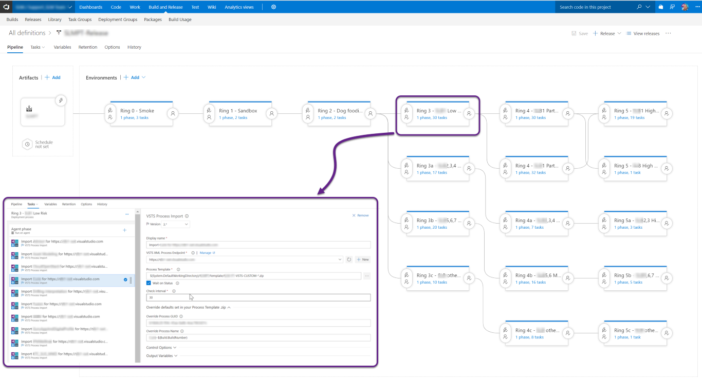
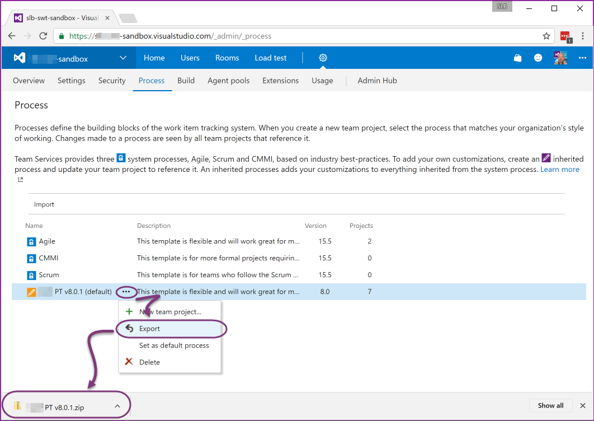
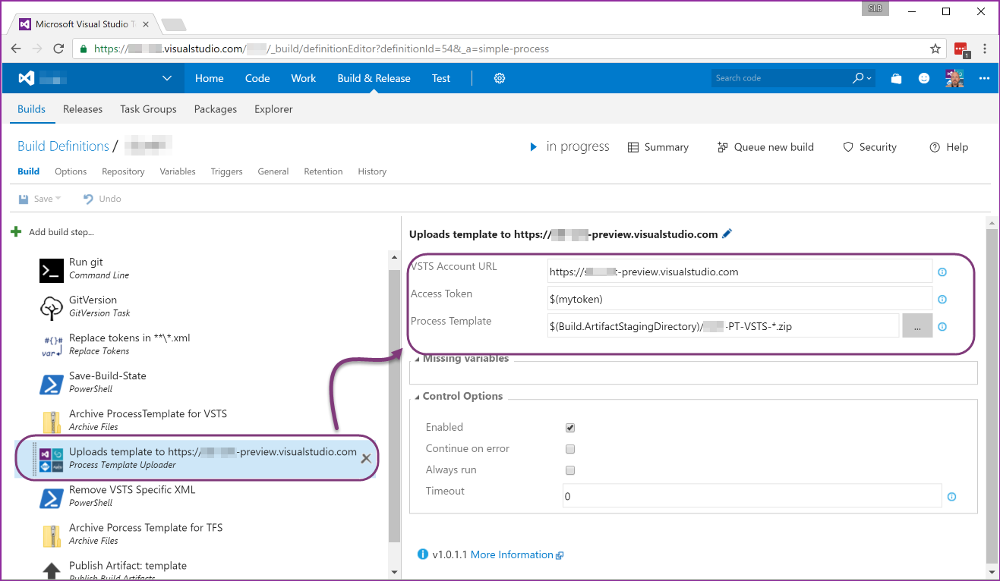

# Azure DevOps Process Tools 

This task automates the Process of managing your Process changes from source control to Azure DevOps so that you can keep all your projects in sync. 

One of the largest issues for Enterprise is everyone using a different process template for their projects. When you move your Collection to Azure DevOps with your custom Process Template you get a "Phase 1 enabled account". This account does not let you edit the Process Template in the UI and instead lets you download and upload the process template.

These build tasks allow you to manage both the XML and Inherited processes in Azure DevOps Services. You can use this task to create a controlled exposure CI/CD Pipeline that deploys and manages your process between Organisations.

## What can you do with this tool?

- **Azure DevOps Services Process (XML)** Task - Upload XML Based Process from an export
- **Azure DevOps Services Process (Inherited)** Task - Migrate Inherited Process(s) between Organisations (uses [https://github.com/Microsoft/process-migrator](https://github.com/Microsoft/process-migrator))

Full documentation is available on [https://dev.azure.com/nkdagility/Azure-DevOps-Process-Tools/](https://dev.azure.com/nkdagility/Azure-DevOps-Process-Tools/)

## Getting the Tools

 You can [install from the Visual Studio Marketplace](https://marketplace.visualstudio.com/items?itemName=nkdagility.processtemplate) 

## Puting your Template under source control

After you have had your collection imported to VSTS by Microsoft you will be able to download your process template from the administration page.

Go to the home page of your Azure DevOps Service Organisation and head over to "MyAccountName | Account Settings | Process", where you will see a list of the available process templates. 

Here you can select the process template that you want to Export and save it locally. Once you have saved it locally you can unpack it and put the resulting XML under source control in a Git Repository. I recommend that you add the unpacked repository to a folder "src\MyPT\*" under your Git Repository. You may need additional files and you don't want them getting mixed up.

Note: If you don't see the "Import" or "Export" buttons then you likely **do not** have a *Phase 1* enabled account. You will have to contact Microsoft support and see if it is possible to activate this. There are caveats as you will be unable to use the GUI based customisations.

## Creating an Automated Build Process

Once you have your process template under source control you can go ahead and create an automated build to package it up.

The easy way is simply to zip the folder that you put the process template into. The final Zip is what we are going to upload. Here I am creating the zip and uploading it to TFS as an asset.

You can then use the [VSTS Process Template Uploader](https://marketplace.visualstudio.com/items?itemName=nkdagility.processtemplate) build task to push the template to a Phase 1 enabled account.

Note: If you try to push to a non-phase1 enabled account you will get a 404 for the API.
